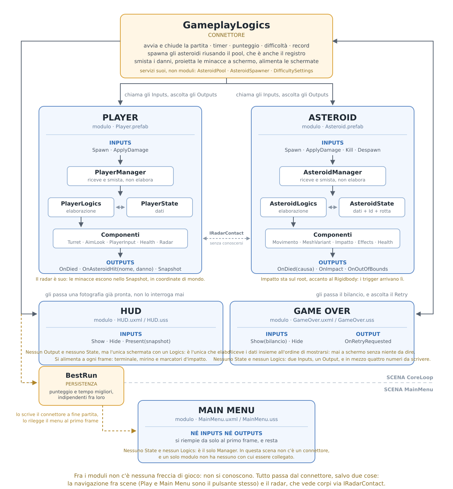

# Solutioning

Panoramica **dall'alto** di come è costruito il gioco secondo il metodo
**moduli / componenti / stati / connettori**. Risponde a tre domande e a nessun'altra:
quali sono i pezzi, di cosa risponde ciascuno, e dove il progetto si discosta dalla
regola.

**Cosa non sta qui:** come una cosa è implementata, perché una riga è scritta così, e
cosa c'era prima. Il metro per decidere: *se cambio il codice senza spostare una
responsabilità e devo aggiornare questo file, il file è troppo dettagliato.*

Due scene: `Assets/Scenes/MainMenu.unity`, da cui si entra, e
`Assets/Scenes/CoreLoop.unity`, dove si gioca. Il flusso fra le due sta al §7.

---

## 1. Glossario del metodo

- **Modulo (entità)** — un'unità autonoma di gioco (es. Player, Asteroid).
  Espone **Inputs** (cosa gli si può chiedere di fare) e **Outputs** (cosa notifica
  quando gli succede qualcosa). Un modulo **non conosce gli altri moduli**.
- **Componente** — un pezzo di comportamento riusabile montato dentro un modulo
  (es. salute, mira, torretta). Conosce solo se stesso, non il gioco.
- **Connettore** — lo script che collega i moduli fra loro: ascolta gli Outputs
  e chiama gli Inputs. È l'unico che ha una visione d'insieme.
- **Stato** — i dati che descrivono la situazione corrente di un modulo o del gioco,
  e che determinano cosa può o non può succedere.

**Regola guida:** i moduli non si parlano mai direttamente. Tutto passa dal connettore.
Questo permette di sostituire o testare un modulo senza toccare gli altri.

---

## 2. Panoramica del core loop

```
                    ┌──────────────────┐
                    │  GameplayLogics  │   (connettore)
                    └────────┬─────────┘
                 ┌───────────┴───────────┐
                 ▼                       ▼
           ┌──────────┐            ┌──────────┐
           │  Player  │            │ Asteroid │   (moduli)
           └──────────┘            └──────────┘
```

Il Player e l'Asteroid non si conoscono. Quando uno dei due produce un evento
(es. uno sparo va a segno, un asteroide raggiunge la navicella), l'evento sale al
connettore, che decide cosa deve succedere e lo comunica all'altro modulo.

---

## 3. Architettura di un modulo

Tutti i moduli sono costruiti allo stesso modo — Player, Asteroid e quelli che
verranno. Il flusso è sempre:

```
Input → <Modulo>Manager → elaborazione logica → Output
```

Le parti in gioco:

- **`<Modulo>Manager`** — MonoBehaviour sull'oggetto root del prefab. È l'**unica
  porta d'ingresso** del modulo: espone gli Inputs come metodi pubblici e gli Outputs
  come eventi. Non contiene logica di gioco, riceve e smista.
- **`<Modulo>State`** — classe semplice in un file separato, dichiarata come
  variabile dentro il Manager. Contiene i **dati** del modulo (vita, arma selezionata,
  vivo/distrutto…).
- **`<Modulo>Logics`** — classe semplice in un file separato, dichiarata come
  variabile dentro il Manager. Contiene l'**elaborazione**: legge e aggiorna lo State
  e pilota i componenti.
- **Componenti** — MonoBehaviour veri e propri, che agiscono sulla scena
  (torretta, salute, mira). Non si conoscono fra loro: è Logics a orchestrarli.

Esempio di flusso completo:

```
GameplayLogics → PlayerManager.Spawn() → playerLogics.Spawn()
                                          ├─ aggiorna PlayerState
                                          └─ attiva il componente Torretta
```

Layout nel prefab:

```
<Modulo>            ← <Modulo>Manager
├── Scripts         ← tutti i componenti (MonoBehaviour)
└── ...             ← mesh, camera, pivot e altri oggetti di scena
```

**Regola:** chi sta fuori dal modulo parla solo con il Manager.
Mai direttamente con i componenti, con Logics o con State.

**Le tre parti sono la forma piena, non un minimo da rispettare.** Un modulo tiene le parti
che gli servono: State se ha dati che non sono già a schermo, Logics se fra l'Input e il
risultato c'è qualcosa da *decidere*. Dove non c'è niente da decidere, Logics sarebbe un
corridoio e non una stanza — un muro in più che gli eventi devono attraversare per uscire
uguali da entrambe le parti. Player, Asteroid e HUD hanno Logics perché elaborano; Game Over
e Main Menu hanno tutto dentro il Manager. **Quello che non cambia mai è la porta:** da fuori
si vedono Inputs e Outputs, e chi sta fuori non sa quante stanze ci siano dietro.

**Unica eccezione a oggi:** `AsteroidImpactComponent` sta sul root e non sotto `Scripts`.
Non è una scelta di stile, è la fisica: Unity recapita `OnTriggerEnter` al GameObject
del collider e a quello del Rigidbody, e il Rigidbody dell'asteroide sta sul root.

### 3.1 Dove stanno i file

```
Assets/Scripts/
├── Common/         ← ciò che non è di nessuno: BestRun, UiFormat, UiElements,
│                     GameScenes, IRadarContact, ThreatContact, SweptSphere
├── Components/     ← tutti i componenti, di chiunque siano
├── Gameplay/       ← il connettore, il suo State e i suoi servizi
├── Player/         ← Manager, Logics, State del Player
├── Asteroid/       ← Manager, Logics, State dell'Asteroid
├── Hud/            ← Manager e Logics dell'HUD
├── GameOver/       ← Manager del Game Over
└── MainMenu/       ← Manager del Main Menu

Assets/UI/          ← una cartella per schermata (.uxml + .uss), più Terminal.uss
                      e le Panel Settings
```

I componenti stanno tutti insieme perché sono la parte riusabile: `HealthComponent`
è montato sia sul Player sia sull'Asteroid, e nessuno dei due lo possiede.

`Common/` segue la stessa logica un piano più in su: `UiFormat` decide come si scrive un
punteggio e un tempo, e lo decide per tutte e tre le schermate; `UiElements` decide come si
*tocca* un elemento — trovarlo, scriverci, accendergli una classe — e ci tiene anche la rete:
se l'elemento non c'è il gesto non fa niente e non esplode, così nessuna schermata ha più
bisogno di controllarlo riga per riga. `BestRun` è l'unico posto che conosce le chiavi dei
PlayerPrefs; `GameScenes` l'unico che conosce i nomi delle scene.

Ci stanno anche i tre pezzi del radar che non appartengono a nessun modulo: `IRadarContact`
(cosa un corpo deve saper dire di sé per essere visto), `ThreatContact` (una minaccia in
coordinate di mondo) e `SweptSphere` (la geometria pura: quando una sfera in moto tocca una
scatola ferma). Nessuno dei tre nomina né la navicella né l'asteroide.

`Terminal.uss` è la stessa idea per l'aspetto: quello che le schermate hanno in comune
sta scritto lì una volta sola, e ogni foglio di modulo tiene solo ciò che è suo.

---

## 4. Moduli

### 4.1 Player

Prefab: `Assets/Navetta/Player.prefab`

La postazione del giocatore: la navicella con la torretta montata sopra. È fissa nello
spazio, ruota per mirare e spara.

**Di cosa è responsabile**
- gestire la propria mira e il proprio sparo;
- gestire la propria salute e il proprio stato di distruzione;
- reagire al danno che riceve;
- **accorgersi di chi sta per colpirlo**, e fra quanto;
- notificare all'esterno gli eventi che lo riguardano.

**Di cosa NON è responsabile**
- non sa cosa sia un asteroide — nemmeno il suo radar, che vede corpi e non sassi;
- non decide quando la partita inizia o finisce;
- non calcola punteggio, timer o difficoltà;
- non sa che esista uno schermo: le minacce escono in coordinate di mondo.

**Il radar è suo, e questo è il punto.** «Chi sta per colpirmi» sembra una domanda del
connettore, perché da lì è comodo rispondere. Ma un parametro nel connettore non è
portabile: il giorno in cui nasce una seconda modalità di gioco va riscritto, mentre un
componente arriva col prefab e funziona ovunque lo si monti. Ed è anche il verso giusto
della finzione — l'asteroide non telefona alla navicella.

`RadarComponent` proietta in avanti da ogni placca della `DamageZone` un corridoio
(`Physics.OverlapBoxNonAlloc`, a intervalli: un radar *spazza*, non vede di continuo). Il
corridoio non deve essere preciso, deve essere **generoso**: dice solo chi vale la pena
esaminare. A decidere è poi lo *slab test* di `SweptSphere`, che sulla traiettoria vera
risponde **se** e **fra quanto**.

Il radar **non viene avvisato** quando un contatto sparisce: lo chiede, guardando
`IRadarContact.IsActive`. Un abbattimento, un fuoricampo o uno svuotamento del campo non
devono attraversare mezzo gioco per arrivargli.

**La portata sostituisce il preavviso a tempo.** Non si decide più «annuncia dieci secondi
prima»: la minaccia compare quando entra in portata, quindi un corpo veloce si annuncia da
più lontano di uno lento. La portata è una proprietà della navicella, e come tale un
domani può degradarsi coi danni o migliorare con un potenziamento.

Oltre agli eventi, il Manager espone uno **`Snapshot` in sola lettura**: è da lì che il
connettore prende ciò che serve all'HUD, senza che lo State esca dal modulo.

### 4.2 Asteroid

Prefab: `Assets/Asteroids/Asteroid.prefab`

Il singolo asteroide che viaggia verso la navicella. Non è usa-e-getta: l'istanza nasce
una volta sola e per il resto del gioco va e torna dal pool.

**Di cosa è responsabile**
- muoversi nella direzione che gli è stata data e accorgersi di aver finito la corsa;
- accendere una delle mesh disponibili a ogni comparsa;
- gestire la propria salute e la propria distruzione;
- accorgersi di aver toccato qualcosa di fisico;
- notificare all'esterno gli eventi che lo riguardano.

**Di cosa NON è responsabile**
- non sa chi lo ha colpito né cosa ha colpito;
- non decide quanti punti vale;
- non decide dove nasce, dove va né quanto corre;
- non decide se e come dividersi (la regola del *split* è di gioco, non dell'asteroide);
- non si spawna da solo.

Un solo Rigidbody kinematico sul root raccoglie i collider delle mesh figlie in un
*compound collider*: è ciò che fa scattare i trigger, ed è il motivo del vincolo al §3.

### 4.3 HUD

Il pannello di stato in gioco (GDD §15), in UI Toolkit.

**Non ha uno State**: il suo stato è già a schermo. Riceve a ogni frame una fotografia
già pronta (`HudSnapshot`) e la riversa sugli elementi. **È però l'unica delle tre schermate
che tiene un Logics**, perché è l'unica che elabora: soglie di colore, coordinate da
ribaltare, marcatori da accendere e spegnere — e lo fa a ogni frame, quindi gli elementi se
li tiene da parte invece di ricercarli ogni volta. Dentro quella fotografia c'è
anche quella del Player, inoltrata così com'è: il connettore non la traduce.

**Di cosa NON è responsabile**
- non conosce né il Player né l'Asteroid;
- non legge niente da solo: aspetta che il connettore gli passi i dati;
- non decide quando mostrarsi.

**I marcatori d'impatto non sono asteroidi.** L'HUD ne riceve un punto sullo schermo e
dei secondi, già in ordine di urgenza, e non sa cosa ci sia dietro. Quanti se ne possano
disegnare lo dice l'UXML: se le minacce sono di più, restano fuori le meno vicine.

**Il mirino non legge il mouse.** Riceve la posizione di mira nello snapshot, che nasce
dalla stessa sorgente da cui parte il colpo: se la leggesse per conto suo, il giorno in
cui la mira venisse smorzata o clampata disegnerebbe una bugia senza segnalarla. Cambia
forma con l'arma, e anche quello lo sa dalla fotografia che riceve.

**Il cursore è dell'HUD, e di nessun altro.** Siccome il mirino ne prende il posto, è l'HUD a
spegnerlo mentre è a schermo — ed è sempre l'HUD a riaccenderlo quando si toglie di mezzo, o
quando si esce dal Play a partita in corso. *Chi lo spegne lo riaccende:* per questo le altre
due schermate non lo toccano, e non esiste nessuno spegnimento che possa lasciare il giocatore
senza puntatore.

### 4.4 Game Over

La schermata di fine partita (GDD §15).

Come l'HUD **non ha uno State**, e a differenza dell'HUD **non ha nemmeno un Logics**: fra il
bilancio che arriva e i numeri che compaiono non c'è niente da decidere, e sta tutto dentro il
Manager. A differenza dell'HUD riceve i dati **insieme all'ordine di mostrarsi**, perché l'HUD si alimenta a ogni frame mentre questa si riempie una volta
sola: un momento in cui fosse a video senza niente da dire sarebbe uno stato che non deve
esistere.

**Di cosa è responsabile**
- mostrare il bilancio della partita, i due record, e un badge accanto a ciascun record
  appena caduto.

**Di cosa NON è responsabile**
- non sa cos'è un asteroide né una navicella;
- non calcola niente: il bilancio glielo passa il connettore già chiuso;
- non sa se un record è stato battuto — glielo dicono;
- non tocca il cursore: quando lui compare, l'HUD l'ha già riacceso (§4.3).

**I due pulsanti prendono strade diverse**, ed è la deroga del §7.2: `Retry` risale al
connettore come Output, `Back to Menu` carica la scena da sé.

### 4.5 Main Menu

La schermata d'ingresso (GDD §4/§15). Mostra il titolo e i due record.

**È il modulo più magro del progetto: solo il Manager.** Nessuno State, nessun Logics, nessun
Output — l'unico pulsante è Play, che carica la scena di gioco da sé — e **nemmeno un Input**:
nella sua scena c'è lui solo (§5.5), quindi non esiste nessuno che potrebbe dirgli di mostrarsi,
e non esiste un momento in cui debba stare via. Si riempie al primo frame e resta finché la
scena non cambia.

È anche l'unico modulo che **legge i propri dati**: i due record se li prende da `BestRun`.
Senza un Logics da tenere all'oscuro, la fotografia che gliela portava non serve più — due
numeri arrivano da una parte e vanno nell'altra, nella stessa stanza.

---

## 5. Connettore

### 5.1 GameplayLogics

**Un solo script**, affiancato da un proprio State e da tre classi di servizio che sono
sue e non moduli: `AsteroidPool` (il pool e il registro), `AsteroidSpawner` (il ritmo e il
punto di lancio) e `DifficultySettings` (solo numeri e curve).

`GameplayState` sono i dati della partita: se si sta giocando, da quanto, con quanti
punti, quanto è dura adesso e a che livello si legge. Non è una deroga al §3 — il
glossario chiama Stato anche i dati *del gioco*, e questi sono quelli.

Parla con i moduli solo attraverso i loro Manager.

**Responsabilità**
- spawn degli asteroidi: dove nascono, verso dove vanno, quanto corrono;
- progressione della difficoltà;
- start / end del ciclo di gioco;
- timer di gioco;
- gestione del punteggio, e il salvataggio dei record a fine partita;
- gestione dei danni fra Player e Asteroid, in entrambe le direzioni;
- decidere **quanto stretto puntano** i lanci, che è la pressione vera del gioco;
- **portare le minacce dal mondo allo schermo**, che è l'unica cosa che qui si lavora
  davvero, perché serve la camera;
- alimentare l'HUD e chiudere il bilancio nella schermata di Game Over.

**Di cosa NON è responsabile**
- non implementa il comportamento interno dei moduli (non muove l'asteroide,
  non ruota la torretta): chiede, non fa;
- **non decide più chi è una minaccia**: quella domanda è tornata a chi rischia (§4.1);
- non carica scene: la navigazione non passa di qui (§7.2).

**Chi sta per colpire lo sa la navicella, non il connettore.** La domanda «questo mi
colpirà?» sembra doverla risolvere chi vede entrambi i moduli, e per un po' è stato così.
Ma la risposta non richiede di vederli entrambi: richiede che il corpo in volo **dichiari
la propria rotta** e che chi rischia sappia **cosa deve difendere**. Con `IRadarContact` a
fare da tramite, nessuno dei due deve sapere cosa sia l'altro — e il rilevamento diventa
una cosa che viaggia col prefab del Player invece che una riga di questo file.

Quel che resta qui è la **traduzione**: da coordinate di mondo a pixel ci passa solo chi ha
la camera. Chi finisce dietro di essa non si disegna, perché lì `WorldToScreenPoint`
specchia le coordinate e il marcatore indicherebbe la direzione sbagliata.

L'impatto lo fa il **corpo** dell'asteroide, non il suo centro: la previsione gonfia la
zona di danno di quanto è grosso il sasso, e quanto sia grosso lo **dichiara l'asteroide**.
È il modulo a conoscere la propria stazza, e stimarla da fuori sarebbe una seconda verità.

*Il giorno in cui gli asteroidi cambiassero rotta in volo, basterebbe che aggiornassero la
`Velocity` nel proprio State: il radar ricalcola a ogni spazzata, e non se ne accorgerebbe
nessuno.*

**Ricominciare e cominciare sono la stessa cosa.** Il Retry è agganciato direttamente a
`StartGame()`: non c'è un percorso separato, perché non servirebbe a niente di diverso.

### 5.2 Object pooling degli asteroidi

Gli asteroidi non vengono creati e distrutti a ogni spawn: il connettore mantiene un
**pool** di istanze che riusa. Oltre al vantaggio in performance, il pool è anche il
**registro degli asteroidi attivi** — ed è questo che permette ai moduli di restare
ignoranti l'uno dell'altro: il Player non ha mai un riferimento a un asteroide, comunica
un nome e una quantità di danno, e il connettore ritrova il bersaglio nel registro.

Il pool nasce nell'`Awake` del connettore, non allo start della partita: è infrastruttura,
non un fatto della singola partita. Fra un Game Over e un Retry le istanze restano.

### 5.3 Progressione della difficoltà

La difficoltà è un **numero solo**, da 0 a 1, che nasce dal tempo trascorso passando per
una curva editabile nell'Inspector. Arriva a 1 e lì si ferma: la pressione resta al
massimo fino alla sconfitta (GDD §12).

```
tempo trascorso  →  t = curva(tempo / durata rampa)     0..1

                    t  →  intervallo di spawn    dal lento al rapido
                       →  banda di velocità      dal piano al veloce
                       →  addensamento della mira  dal largo allo stretto
```

Le tre cose passano tutte dallo stesso `t`, così non possono divergere.
L'intensità si **ricava** dal tempo invece di accumularsi, quindi un frame lungo non può
farne perdere un pezzo.

**La pressione vera è quanto stretto ti puntano.** Velocità e ritmo fanno il rumore, ma è
quanti ti arrivano addosso a decidere quanto devi sparare. Il campo attorno alla navicella
però **non cambia mai**: è un disco solo, di raggio fisso. Quello che cambia col tempo è
dove i lanci si **affollano** dentro quel disco.

Il meccanismo è un esponente. La distanza dal bersaglio si pesca come
`raggio × caso^focus`, e quel `focus` è l'unica manopola:

```
focus = 0.5   →  densità uniforme sull'area del disco (è la radice quadrata)
focus  > 0.5  →  i lanci si stringono verso la navicella
```

Lo 0.5 non è un valore arbitrario: l'area di un disco cresce col quadrato del raggio,
quindi è la radice quadrata a rendere la dispersione davvero uniforme. Da lì in su
l'addensamento diventa **una scelta** invece che un effetto collaterale del conto.

*Non è una quota di impatto e non pretende di esserlo: quanti colpiscano davvero dipende
anche dalla stazza del sasso estratto. In cambio non esiste nessuna fascia proibita
attorno alla navicella, e i sassi possono sfiorarla — che in un gioco dove stai fermo a
sparare vale più di un numero esatto nell'Inspector.*

**La velocità non è un numero, è una banda.** I due estremi hanno ciascuno la propria
rampa, così la forbice fra l'asteroide più lento e il più veloce può allargarsi o
stringersi crescendo la difficoltà, ed è una scelta e non una conseguenza.
`DifficultySettings` dice dentro quale banda si può andare; **chi pesca è lo spawner**,
che è già il posto dove vive il caso.

**Il livello 1..5 è una lettura**, non una meccanica: si ricava dall'intensità e serve
soltanto all'HUD. Segue quindi la curva e non l'orologio — dice quanto è dura *adesso*.

### 5.4 Chi assegna i punti

I punti non li dà la morte in sé, li dà il **modo** in cui è arrivata: valgono solo gli
asteroidi abbattuti sparando. Chi si schianta sulla navicella e chi esce dal campo torna
nel pool a mani vuote.

### 5.5 La scena del menu non ha un connettore

Un connettore serve quando ci sono moduli che devono ignorarsi a vicenda. Nella scena
`MainMenu` c'è **un modulo solo**: un connettore lì esisterebbe unicamente per inoltrargli
due numeri, e sarebbe cerimonia.

Il prezzo è dichiarato: quel Manager conosce l'esistenza della persistenza. La conosce
attraverso `BestRun`, non con le chiavi dei PlayerPrefs in mano, e `MainMenuLogics` resta
comunque all'oscuro di tutto.

---

## 6. Il quadro d'insieme



Il connettore in alto è l'unico che vede tutto. I moduli sotto sono chiusi e si
costruiscono tutti allo stesso modo, senza conoscersi fra loro. Player e Asteroid sono
anche simmetrici: stessa forma, stesse tre parti. Le tre schermate sono più magre perché
non hanno uno stato proprio da tenere, ma entrano dalla stessa porta.

Le schermate però non sono magre allo stesso modo, e il disegno lo dice: l'HUD elabora e tiene
il suo Logics, il Game Over ha due Inputs e un Output e nient'altro, il Main Menu è un Manager
e basta.

La riga tratteggiata separa le due scene, e il riquadro dei record ci sta a cavallo: è
l'unica cosa che le attraversa.

Dentro un modulo la direzione è sempre la stessa — **Manager → Logics → componenti** —
e dall'esterno se ne vedono solo la prima e l'ultima riga: **Inputs** e **Outputs**.
Tutto il resto è interno e può cambiare senza rompere niente.

*Sorgente del disegno: `Architettura.svg`, da modificare quando l'architettura cambia.*

---

## 7. Le due scene, il flusso e i record

### 7.1 Il giro completo

```
MainMenu ──[Play]──▶ CoreLoop ──[0 HP]──▶ Game Over ──[Retry]──▶ ricomincia lì
    ▲                                          │
    └──────────────[Back to Menu]──────────────┘
```

Il Retry non ricarica la scena: riazzera lo stato e il pool resta com'è. Il Back to Menu
e il Play invece caricano davvero l'altra scena, e tutto ciò che c'era viene distrutto.

### 7.2 La deroga: chi carica le scene

**La navigazione fra scene non passa dal connettore.** `Play` e `Back to Menu` caricano la
scena direttamente dal `Logics` del loro modulo: il pulsante *è* l'azione. `Retry` invece
resta un Output, perché ricominciare una partita è una decisione di gioco — riazzera
punteggio, timer e difficoltà e rimette in campo la navicella — e quelle cose le sa solo
il connettore.

È una deroga consapevole alla regola guida del §1, presa per la scala di questo gioco: far
passare Play e Back to Menu da un connettore aggiungerebbe un rimbalzo che non decide
niente. Il prezzo è che i due moduli conoscono i nomi delle scene, e per questo li conoscono
attraverso `GameScenes` e non come stringhe sparse nel codice.

*Se un giorno cambiare scena volesse dire anche salvare, o mostrare una transizione, o
chiedere conferma, quei pulsanti tornano a essere Outputs.*

### 7.3 I record

`BestRun` (in `Common/`) è l'unico punto del progetto che conosce le chiavi dei
PlayerPrefs. Non è un modulo e non è un componente: non ha presenza in scena e non ha
comportamento. È lo stato che sopravvive alla sessione.

**I due record sono indipendenti.** Il punteggio più alto e la sopravvivenza più lunga
possono venire da due partite diverse, ed è voluto: fare molti punti in fretta e resistere
a lungo sono due modi diversi di giocare bene, e battere l'uno non deve cancellare l'altro.
Il prezzo è che i due numeri a schermo non raccontano necessariamente la stessa partita.

A fine partita il connettore li registra **prima** di mostrare la schermata, così il record
a video è già quello nuovo.

Chi li legge dipende dalla scena, e l'asimmetria è voluta: nel Game Over li passa il
connettore, che è già lì nel momento in cui vengono salvati; nel Main Menu li legge il
modulo, perché in quella scena non c'è un connettore (§5.5).

### 7.4 Riepilogo delle deroghe

Tutto ciò che nel progetto si discosta dalla forma del §3, in un posto solo:

| Deroga | Dove | Perché |
|---|---|---|
| Nessuno State | HUD, Game Over, Main Menu | il loro stato è già a schermo; una copia in memoria sarebbe una seconda verità da allineare a mano |
| Nessun Logics | Game Over, Main Menu | fra il dato e lo schermo non c'è niente da decidere: separare aggiungerebbe un muro, non una stanza |
| Nessun Input | Main Menu | non c'è nessuno che potrebbe chiamarlo, e nessun momento in cui debba stare via |
| `AsteroidImpactComponent` sul root | Asteroid | Unity recapita `OnTriggerEnter` al GameObject del Rigidbody, e quello sta sul root |
| `Show` che porta già i dati | Game Over | si riempie una volta sola: non esiste un momento in cui debba stare a schermo vuoto |
| Il modulo si riempie da solo | Main Menu | nella sua scena non c'è nessun connettore che possa passargli i dati |
| Il modulo carica la scena | Main Menu, Game Over | la navigazione non è gameplay (§7.2) |
| Il modulo legge la persistenza | Main Menu | conseguenza del §5.5; la legge da `BestRun`, non dai PlayerPrefs |
